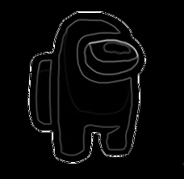

learn_image_processing
======================

This repo is not for production, its just a place for me to learn more about
image processing and play around with some basic image processing algorithms.

Sample images to feed this program can be found in the [img](./img/) folder.

Implemented
-----------

* [X] Simple gradiant
* [ ] Prewitt operator gradiant
* [ ] Seam carving

Showcase
--------

Base image

Simple gradiant

